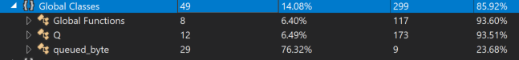

# Introduction
This document describes the testing effort completed to test the queue management methods. It will cover the overall approach, findings and a few recommendations for making the code more testable.

## Result
Four catagories of testing was performed: 
- Unit Testing
- Performance Testing
- Stress Testing
- Security Testing

As the result of performed testing above the following bugs were found:
- Access violation when attempting to write 2048 (boundry condition) worth of data in queues
- Access violation when attemping to destroy the same queue multiple times. Protections need to be put in place for scenarios like this.
- When max number of queues were created and destoried, there seemed to be a queue lingering around at the end
- If the queue is filled up it's max size, dequeued and destroyed we run into an issue with it not being destoryed
  
## Code Coverage
After testing was completed, code coverage was analysed to find the missing gaps. Having good good coverage does not mean we have good testing, it just helps you see the gaps.



In this case, code coverage was able to highlight some dead code that weren't being used at all. Specifically `queued_byte` has a few methods that aren't being utilizied and it's contributing to lower code coverage numbers.

## Security Testing

Security testing was performed using Visual Studio's built-in `Code Analysis` tool due to time constraints. The following issues were observed. These are warnings that need to be addressed

```
1>cl : command line warning D9035: option 'Gm' has been deprecated and will be removed in a future release
1>stdafx.cpp
1>cl : command line warning D9035: option 'Gm' has been deprecated and will be removed in a future release
1>Queue.cpp
1>main.cpp
1>C:\Temp\CodingTests\SuckerPunch\SuckerPunch\main.cpp(78,12): warning C4244: 'argument': conversion from 'time_t' to 'unsigned int', possible loss of data
```


## General Testing Approach
The following methods are implemented as global and they have declared quite few static global variables which they use for testing.

```c++
Q* create_queue();			//Creates a FIFO byte queue, returning a handle to it.
void destroy_queue(Q* q);	//Destroy an earlier created byte queue.
void enqueue_byte(Q* q, unsigned char b);	//Adds a new byte to a queue.
unsigned char dequeue_byte(Q* q);			//Pops the next byte off the FIFO queue.
```

This approach makes the code extremely hard to test for the following reasons:
  - Each test case may not get a clean context to start (i.e. failing the error code paths will cause all subsequest tests to fails)
  - The error methods `on_out_of_memory()` and `on_illegal_operation()` enter a infinite while loop which again makes the testing more difficult
  
As such, we needed a clean approach to make the tests "CI friendly". To that end, the following solutions were considered:

- Change the method definition to take in a `ErrorReporting` object. The default implementation of the class could be the inifite loop that currently exist but it would allow us to override this method in testing and provide testing hooks instead. I.e. 

```c++
Q* create_queue(ErrorReporting* er);
void destroy_queue(Q* q,ErrorReporting* er)
void enqueue_byte(Q* q, ErrorReporting* er);
unsigned char dequeue_byte(Q* q, ErrorReporting* er);
```

where

```c++
class ErrorReporting
{
public:
    void on_out_of_memory();
    void on_illegal_operation();
}
```

These methods can be overriden to provide the needed operation during testing instead of infinite loops (current implemenation).

- `#ifndef` the needed testing hooks in the code and create a testing build for testing only: In this method a few testing hooks were created and they will stripped out in final production build.
 ```c++
 // error handling
void on_out_of_memory()
{
	printf("out of memory\n");
	
	#ifndef TESTING
	gErrorOccured = true;
	#else
	while(true)
	{;}
	#endif
}
 ```

 As you can see, we can now detect when an issue has occured and in the final production build, we can fall back to the original inifinite loop definition.
 Also further instrumentation was added to code to detect when new queues are lingering around and not being properly destroyed:

 ```c++
 #ifndef TESTING
std::vector<Q*> m_currentQueues;
#endif

Q* create_queue()
{
...
#ifndef TESTING
	m_currentQueues.push_back(q);
#endif
...
}

void destroy_queue(Q* q)
{
#ifndef TESTING
	std::vector<Q*>::iterator it;
	it = std::find(m_currentQueues.begin(), m_currentQueues.end(), q);
	if (it != m_currentQueues.end())
	{
		m_currentQueues.erase(it);
	}
#endif
...
}
 ```

 I would have fully prefered the first solution. However, since the solution required contract changes (and no dev is present in this exercise to converse with), I pursued with the latter solution.


